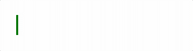

# RTE

<p align="center"></p>
<p align="center"><a href="./README.md">English</a> | <a href="./README-zh.md">中文</a></p>

A simple **WYSIWYG** rich text engine. According to classification, it belongs to **L2** level.

> **This project is still under development and there are many bug**
>
> **The document was written on February 22, 2023**

## Feature

1. WYSIWYG(What you see is what you get)
2. High degree of customization
   - DSL
   - Behavior before and after element activation
   - Behavior of cursor
3. State-driven architecture

## Current Progress

- Focus/Unfocus
  
- Input
  
- Delete
  
- NewLine
  

## Install

Still in development process, can not be intalled by npm.

## Usage

For more information, see the `example` folder.

## Configuration

### Basic

```typescript
const defaultConfig: EditorConfig = {
  font: {
    size: 20,
    family: 'Arial, Helvetica, sans-serif',
    bold: false,
    italic: false,
    color: '#000',
    textBaseline: 'bottom',
    textAlign: 'left',
  },
  page: {
    padding: 20,
    rowSpacing: 4,
  },
  container: '#editor',
};
```

### DSL

RTE allows users to define the DSL they want.

Let's take defining bold syntax as an example.

```typescript
enum NodeType {
  BOLD,
}

export const inline: SchemaConfig['inline'] = (text, syntax) => {
  return {
    bold: {
      reg: /(?<prefix>\*\*|__)(?=\S)(?<content>[\s\S]+?)(\\*)\k<prefix>(?!(\*|_))/,
      render(groups, parsingRecursively) {
        const marker = text(
          // content
          groups.prefix,
          // font config
          { bold: true },
          // marker is not displayed when the cursor is not active
          { beforeActived: { show: false } }
        );
        const content = parsingRecursively(
          // the part that needs recursive parsing
          groups.content,
          // override font settings for content nodes
          { bold: true }
        );

        return syntax(NodeType.BOLD, [marker, ...content, marker]);
      },
    },
  };
};
```

This configuration means that **RTE does not care whether the syntax conforms to the markdown standard at all**. As long as users need it, they can configure the DSL they want.

> Moreover, because the architecture of RTE is very flexible, users can even configure the runtime model of syntax nodes to customize the interaction logic between page elements and cursors.
>
> This has not been realized yet😅, but it does support it in terms of architecture.

## Architecture

RTE adopts a state-driven architecture and introduces a virtual-node system to better abstract the business model.

### OperableNode

Before introducing the architecture, you need to know what **OperableNode** is.

**OperableNode is a interface that carries the ability to interact with the cursor**, which means that all page elements need to implement it, that is, as long as it is implemented, it can interact with the cursor.

Let's look at the main part of it

```typescript
export abstract class OperableNode {
  abstract focusOn(prevState: Snapshot | null, curOffset: number): Snapshot;
  abstract unFocus(prevState: Snapshot): void;

  abstract left(prevState: Snapshot, step: number): Snapshot | null;
  abstract right(prevState: Snapshot, step: number): Snapshot | null;
  abstract up(prevState: Snapshot, step: number): Snapshot | null;
  abstract down(prevState: Snapshot, step: number): Snapshot | null;

  abstract newLine(
    prevState: Snapshot,
    parse: (src: string) => SyntaxNode
  ): Snapshot;

  abstract update(
    prevState: Snapshot,
    char: string,
    parse: (src: string) => SyntaxNode
  ): Snapshot;

  abstract delete(
    prevState: Snapshot,
    parse: (src: string) => SyntaxNode
  ): Snapshot;
}
```

These methods will be called by the cursor, and the user does not need to care about unnecessary problems.

So you only need to implement this interface, and you can freely expand the runtime model you want.

### State Driven

State-driven design is mainly reflected in cursor(Selection) and elements(OperableNode).

**Only need to change the internal state to map to the page in real time**

When the state of a node changes, a special data structure is generated to save the node state, called **Snapshot**.

The global context(Page) captures the change in state through the proxy and then notify to the renderer to render.


As can be seen here, each operation of the cursor generates a snapshot, which is centrally maintained by the state stack.

> PS: Thanks to this, the state stack can be extracted directly into the history stack at a later stage, which can support the undo operation easily.

### Virtual Node

RTE uses a tree-like virtual node system to abstract page elements.

Virtual nodes are divided into the following two categories:

- SyntaxNode
  - type
  - current activation status
- TextNode
  - text
  - style, font
  - the behavior of this node when it is activated and not activated


### Fence

However, the tree structure is very troublesome to deal with, so in the actual implementation, **a special data structure is introduced to flatten the virtual node**, it called **fence**.

Fence is essentially **a forest, made up of trees with a fixed height of 2**, each of these **leaf nodes represents a location where the cursor can be inserted** and it carries the required information.

Just like this


## Contact

- Wechat: D1345118870
- Mailbox:
  - ethanteng1212@qq.com
  - ethanteng1212@gmail.com
