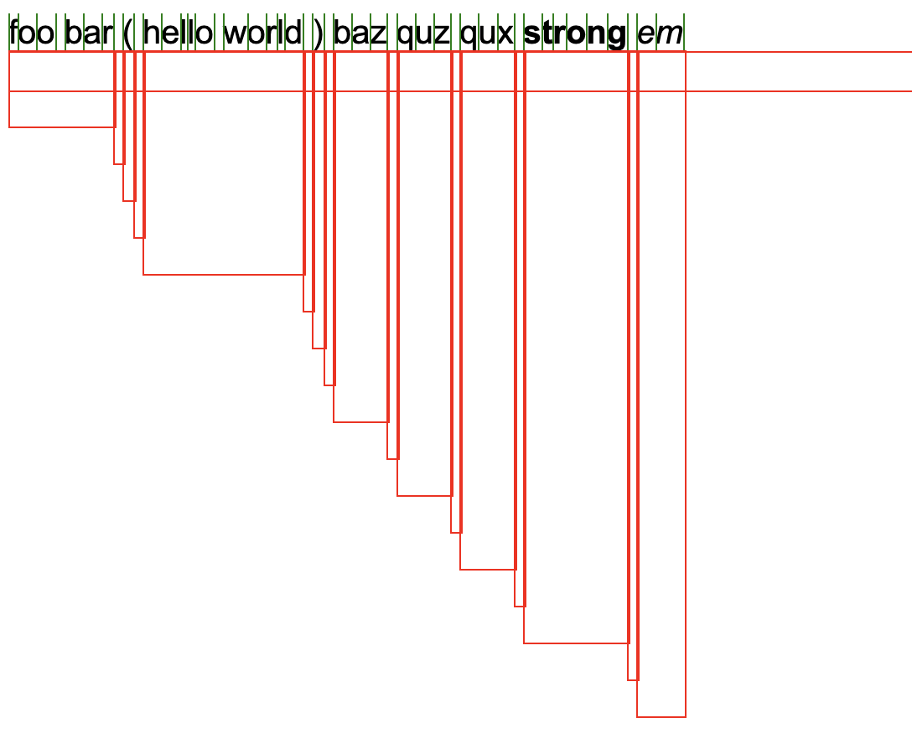
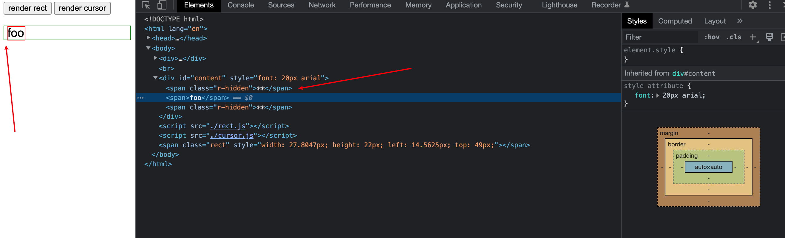

# 2022-12-15

尝试使用 canvas 计算字符宽度, 目前能够计算嵌套 DOM 中可插入光标的位置

demo 源码留个档

接下来需要完成两个需求

1. 根据点击的位置插入光标(二分查找搜最接近的位置)
2. 光标到 VNode 位置的映射

## 补档

完成了第一个需求, 根据点击位置插入光标, 并且能够支持块状光标覆盖字符

先提交一下

第二个需求比较麻烦, 需要从长计议

## 补档

直接用 Range::getClientRects 生成 DOMRect 计算位置的方式是可行的, 但是有点点问题

1. Rect 冗余导致计算错误
   marker 节点在默认不显示时, Rect 的计算会出现问题, 主要是会有很多冗余的 Rect, 造成计算上的错误, 针对这个问题, 决定自己封装 Rect 的生成逻辑, 遍历文本节点, 针对文本节点获取 Rect
2. marker 节点使用 inline-block, 设置宽度高度为 0 以及 overflow hidden 来隐藏, 但是 inline-block 会显示成一个空格, 实际上是换行符
   针对这个问题, 将父节点 font-size 设为 0, 字体大小放在子节点中来设置

## 补档

修复了 marker 节点隐藏时的计算逻辑, 新版在 source/12-15/cursor2

## 补档

完成了光标上下左右移动的功能, 方便测试

下一步需要完成第二个需求, 就是通过光标获取 VNode 位置, 明天再说
