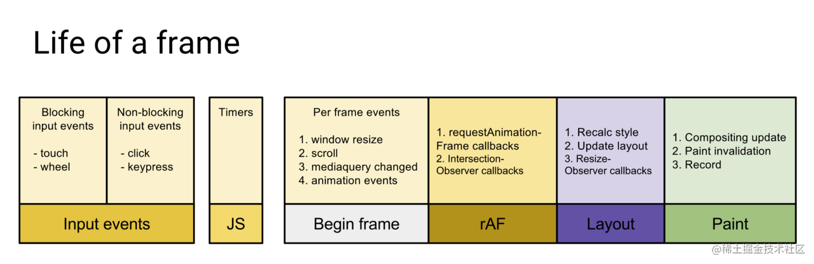
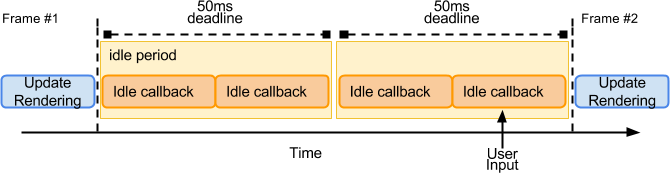

# 2023-7-1

今天偶然看到一篇博客，提到关于浏览器帧数以及刷新率的问题，也聊了 react 的渲染原理，十分适合借鉴一下, 结合之前的调研结果，做一个小小的总结

## 帧率、帧、刷新率

- 帧率(frame rate)用于测量显示帧数的度量, 单位 FPS (frame per second), 每秒显示帧数
- 刷新率表示浏览器所支持的最大帧率，决定上限, 单位 Hz, 144Hz 表示每秒刷新图像 144 次

而由于视觉暂留现象，即刷新过快时，视神经对该物体的印象不会立刻消失，会存在一定时间的延迟，因此只要刷新速度高于这个延迟，就会十分流畅，没有卡顿的感觉

通常 60FPS 能够保证基本流畅，而高于 100FPS 人眼会感受不到明显差别

因此 60FPS 意味着 `1000 / 60 = 16.6666` 即每 16ms 到 17ms 之间输出一帧图像，就可以保证动画基本连贯流畅

可以通过下面的方式去实现兼容不同刷新率的流畅动画, 即稳定的 60 帧刷新率

```js
let prevTimestamp = 0;
let count = 0;
const animation = timestamp => {
  if (count > 200) return;

  const elapsed = timestamp - prevTimestamp;
  if (elapsed > 16.6) {
    render();
    count++;
    prevTimestamp = timestamp;
  }

  requestAnimationFrame(animation);
};

requestAnimationFrame(animation);
```

## 浏览器里一帧中要做的事情



1. 输入事件
   - 阻塞式
     - touch
     - wheel
   - 非阻塞式
     - click
     - keypress
2. 脚本执行
   - js 执行，但是不知道为什么这里只列举了 timers，也许是因为会先执行 timers
3. 帧开始？？
   - 每帧事件？？
     - 窗口变动
     - 滚动
     - 媒体查询
     - 动画事件
4. 特殊回调
   - requestAnimationFrame
   - IntersectionObserver
5. 布局计算
   - 重新计算样式信息
   - 更新布局树
   - ResizeObserver
6. 绘制
   - 组合更新
   - 绘制
   - 记录

因此如果执行 js 的阻塞时间过长，就会导致后续步骤 delay，整个循环无法在一帧时间内完成

**因此 react 中默认的事件切片是 5ms**

## 关于 requestIdleCallback

这个函数会在浏览器空闲时调用 callback, 可以在主事件循环上执行后台和低优先级工作，而不会影响关键事件，比如动画和输入响应

用法略有说法

```js
requestIdleCallback(
  ddl => {
    console.log(ddl.didTimeout); // 表示callback是否在超时时间前执行完成
    console.log(ddl.timeRemaining()); // 表示当前闲置周期的预估剩余毫秒数
  },
  {
    timeout: 1000, // 超时时间
  }
);
```

按照 [W3C](https://www.w3.org/TR/requestidlecallback/) 标准, 空闲时间(idle periods)的定义

在完成一帧的输入、渲染、合成之后，线程会进入 idle period，直到下一帧开始，或者队列中任务被激活，或者收到新的用户输入


据说通常会在动画和屏幕刷新中频繁出现，但是一般时间很短，大概就是在 60Hz 的设备下小于 16ms

还有一个例子就是当没有屏幕刷新出现时，idle periods 的上限失去限制，可能会导致用户输入这样的异步行为被阻塞，ddl 会被设置为最长 50ms, 并且连续出现



- 存在屏幕刷新时，ddl 为当前帧剩余时长
- 不存在屏幕刷新时，ddl 为 50ms，并且会连续出现

并且需要注意的是，这个 API 不能直接操作 DOM，因为 idle periods 一定会在绘制之后进行，如果操作 DOM 导致布局改变，会强制重绘，进而导致卡顿

正确的做法应该是搭配 requestAnimationFrame，在掘金看到的一个很好的例子 [requestIdleCallback](../../source/7-1/requestIdleCallback.html)

明天研究一下 react 具体的渲染做法
