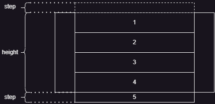
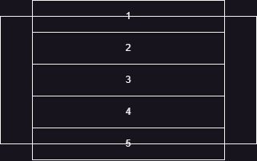

# 2023-6-11

## 关于新的绘制 api

目前暂时想的是简化绘制 api 为一个, 有两种设想

- `Renderer::drawListView(vNode: VirtualNode) -> { lineRect, rectList }`
- `Renderer::drawListView(listView: ListView) -> { lineRect, rectList }`

实际上区别不大，因为在设计中，vNode 主要承载渲染信息，fence 主要承载参数信息

## 关于昨天几个 api 的测试结果

- `translate()`
  - 可以实现，会移动整个 ctx
  - 需要先移动 ctx，再进行绘制
- `moveTo()`
  - 无法实现，给予基于坐标原点的负值参数，无法正确的在显示区域外渲染出元素

那么这样的话其实也没有必要对 `clip` 进行测试了，因为只需要用 `translate` 就可以实现, 并且更为简单方便

## 小总结

基于 `translate()` 进行滚动效果的模拟, 步骤如下

- 需要得到滚动步长，滚动时，基于滚动的步长移动 ctx
- 以移动后位置为起点，开始绘制
- 将 ctx 回位, 进入下一次滚动回调

## 实现关键

如何得到 `translate()` 的 y 轴偏移量

这个偏移量实际上是在此次滚动后，整个被完全/不完全显示的元素被上方卷去的高度

关于这个偏移的计算需要得到滚动前的偏移量, 并且最复杂的地方应该在于如何将超出范围的页面元素排除出渲染队列

为了避免后续重构，最好这次就引入虚拟滚动限制渲染的性能损耗

可以将元素层的高度初始化为 `页面高度 + 2 * step`, 也就是上下各存在一个高度为 `step` 的 buffer

但并不会真正改变元素层的高度，而是在数值计算时认为存在这两个 buffer

画个图先

初始化时

触发一次滚动后

计算公式为

- 初次绘制 `translate(xOffset, -step)`
- 后续绘制 `translate(xOffset, heightOfLastElement)`

## 另一个实现关键

如何得知当前需要渲染哪些元素
