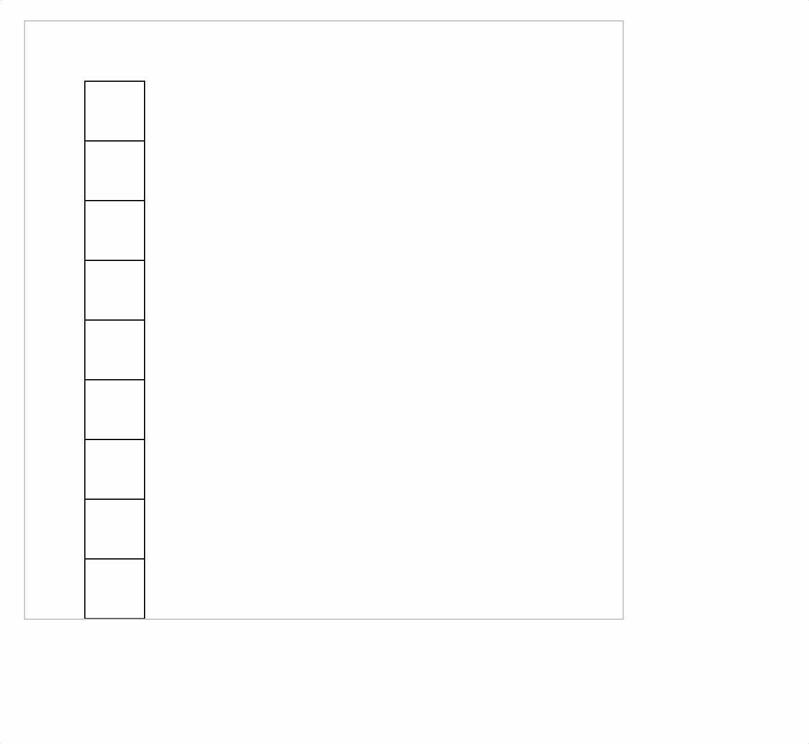

# 2023-6-24

写了个 demo，能够成功模拟出滚动的效果, 在 [mock-scroll](../../source/6-24/mock-scroll.html)

接下来再写一个保证 60 帧刷新率的 demo

写好了，在 [smooth-animation](../../source/6-24/smooth-animation.html)

接下来就是结合起来, 形成滚动的 demo

写好了，在 [smooth-scroll](../../source/6-24/smooth-scroll.html)

不过代码还没有整理，只是初步形成，并且存在 bug, 目前效果如图

帧率是可控的，步长也是可控的，bug 的存在原因是写入 offscreenCanvas 时只写入了 canvas 可视区域内的部分，想来也是很好解决

下一步

- 细化步长和帧率的关系
- branchmark 一下离屏渲染是否真的能起到优化作用
