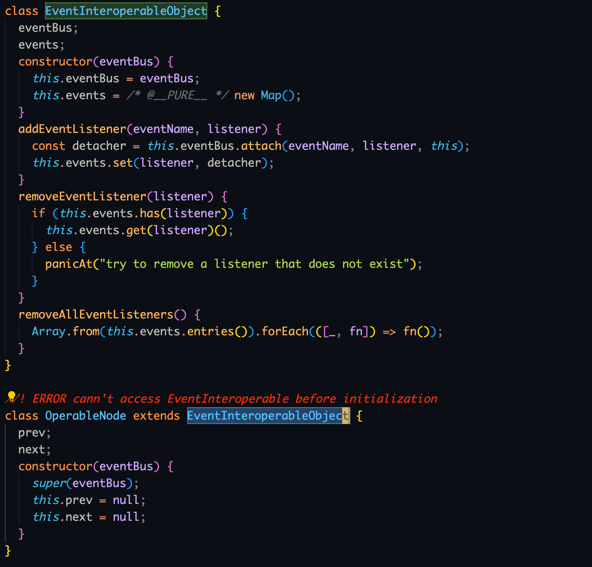
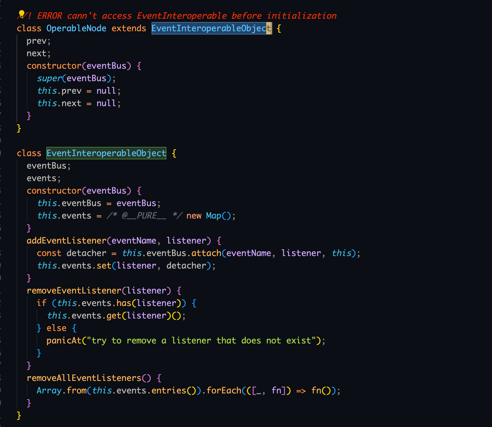

# 2023-5-28

## 一个发现

关于昨天整理的那个关于模块路径导入的问题有了结果， 问题是这样的

在 `lib/types/interfaces/impl/operableImpl.ts`，使用别名导入 `EventInteroperableObject` 运行时会 panic，必须使用相对路径

其他部分都没有出现这种情况

```typescript
// Uncaught ReferenceError: Cannot access 'EventInteroperableObject' before initialization
import { EventInteroperableObject } from 'lib/types';

// OK
import { EventInteroperableObject } from './eventInteroperableImpl';
```

这里分析，既然是运行时 panic，说明是构建产物有问题，打包后看了区别，发现根本问题在于这里 rollup 没有做声明提升

这个是使用相对路径导入的产物



这个是使用模块别名导入的产物



区别在于，后者先使用后声明，导致 panic

感觉像是 rollup 的问题，但是又觉得不应该，怀疑是自己操作有问题，issues 逛了一圈发现没提到相关的问题，过段时间看看 rollup 的源码再说

## 关于打包的问题

打包时出现了两个报错，一个是说配置文件的格式不对，加了个 `--bundleConfigAsCjs` 解决了

另一个问题是使用 esbuild 和 dts 两个插件时, 报错说 `TypeErorr: esbuild is not a function`, dts 类似

查 issue 发现了[解决办法](https://github.com/egoist/rollup-plugin-esbuild/issues/361)

```typescript
// import dts from 'rollup-plugin-dts';
// import esbuild from 'rollup-plugin-esbuild';
import _dts from 'rollup-plugin-dts';
import _esbuild from 'rollup-plugin-esbuild';

const dts = _dts.default ?? _dts;
const esbuild = _esbuild.default ?? _esbuild;
```

还没细看，从解决方案逆推原因应该是因为模块格式的问题，之后再细看
